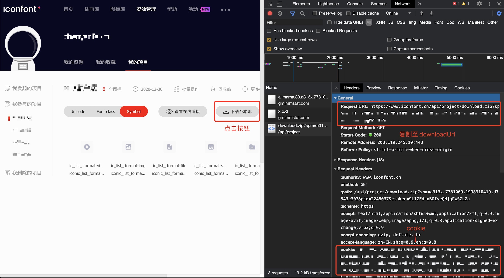

# iconfont-updater

一个用于更新项目内iconfont的库

## 安装

`yarn add iconfont-updater --dev`

或

`npm install iconfont-updater --save-dev`

## 使用

创建一个`.iconfontrc.json`到项目根目录中，按需求配置后即可使用

**由于文件中存在用户敏感信息，建议不要将此文件提交到项目**

```
{
    // 保存到项目的哪个文件夹下
    // 默认项目根目录
    "dirname": "./static/iconfont",
    // 点击下载至本地时get请求的url
    "downloadUrl": "",
    // 点击下载至本地时get请求携带的cookie
    "cookie": "",
    // glob 匹配
    // 由于下载下来的zip解压是一个文件夹所以加**
    // 有些时候我们只需要某种类型的文件，比如我用symbol只需要js文件
    // 默认所有类型文件
    "includes": ["**/*.js"]
}
```

在项目根目录执行 `yarn iconfont-updater` 或 `npx iconfont-updater`

更常见的情况是搭配`package.json`中的`scripts`使用：

在`scripts`内添加

```
{
    "update:iconfont": "iconfont-updater"
}
```

然后 `yarn run update:iconfont` 或 `npm run update:iconfont`

### cookie和downloadUrl的获取


